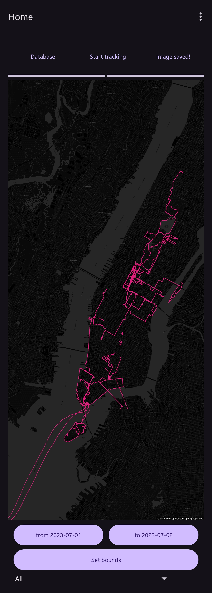
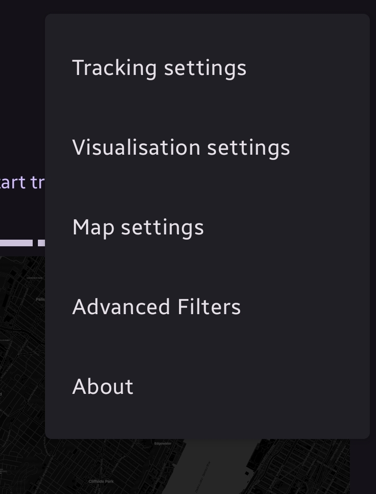
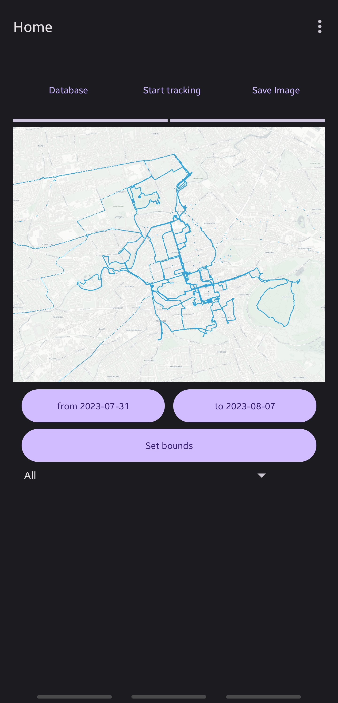
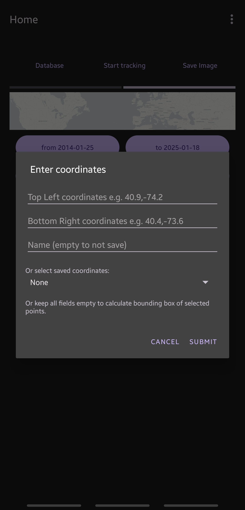
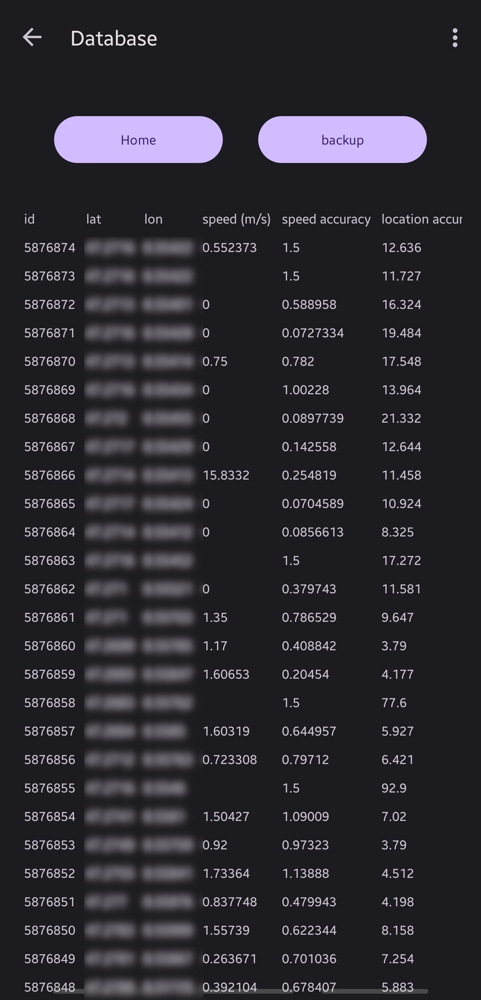

# openGPSLogger

## Releases

### 0.20.0

Status: proof of concept. Bugs and bad UI/UX are expected. Core functionality works.

#### Features
- On tracking, add points to density map databases
- Improve density map color range

### 0.19.1
Status: proof of concept. Bugs and bad UI/UX are expected. Core functionality works.

#### Fixes
- Use different files for each level of density map

### 0.19.0

Status: proof of concept. Bugs and bad UI/UX are expected. Core functionality works.

#### Features
- Add multiple levels of density map (world, continent, country, city, street) with adaptive choice based on osm zoom level

### 0.18.0

Status: proof of concept. Bugs and bad UI/UX are expected. Core functionality works.

#### Features
- Initial version of an adaptive (zoomable) view with density map

### 0.17.1

Status: proof of concept. Bugs and bad UI/UX are expected. Core functionality works.

#### Fixes
- Improve density map visualisation

### 0.17.0

Status: proof of concept. Bugs and bad UI/UX are expected. Core functionality works.

#### Features
- Add continent density map visualisation

### 0.16.0
[apk](release/opengpslogger-0-16-0.apk)

Status: proof of concept. Bugs and bad UI/UX are expected. Core functionality works.

#### Features
- Import files when opened with view action
- After importing file(s), automatically return to main activity

### 0.15.1
Status: proof of concept. Bugs and bad UI/UX are expected. Core functionality works.

#### Fixes
- Fix multiple dialog titles being Tracking settings incorrectly

### 0.15.0
Status: proof of concept. Bugs and bad UI/UX are expected. Core functionality works.

#### Features
- Allow specifying copyright watermark for manually added tile servers

### 0.14.0
Status: proof of concept. Bugs and bad UI/UX are expected. Core functionality works.

#### Features
- More visualisation settings:
  - Allow specifying color opacity percentage

### 0.13.0
[apk](release/opengpslogger-0-13-0.apk)

Status: proof of concept. Bugs and bad UI/UX are expected. Core functionality works.

#### Features
- More visualisation settings:
  - Choose color mode (single color, or multi color per hour / day / month / year)
  - Choose color randomizer seed

### 0.12.0
[apk](release/opengpslogger-0-12-0.apk)

Status: proof of concept. Bugs and bad UI/UX are expected. Core functionality works.

#### Features
- Add copyright notice to bottom right of picture, specifiable by source (text only)

#### Known issues
- When changing aspect ratio, text may get stretched until a reload is triggered
- It is not yet possible to add a copyright notice when manually adding a tile server in the app

#### Images

### 0.11.1
[apk](release/opengpslogger-0-11-1.apk)

Status: proof of concept. Bugs and bad UI/UX are expected. Core functionality works.

#### Minor improvements
- Improve invalidation and redrawing of map
- Redraw map on tile server change
- Add glide caching for images

#### Fixes
- Fix issue where app would crash if the bounding box of selected points is too small

### 0.11.0
[apk](release/opengpslogger-0-11-0.apk)

Status: proof of concept. Bugs and bad UI/UX are expected. Core functionality works.

#### Features
- New settings menu with the ability to select one of the default tile servers, or to add custom tile servers

### 0.10.0
[apk](release/opengpslogger-0-10-0.apk)

Status: proof of concept. Bugs and bad UI/UX are expected. Core functionality works.

#### Features
- Allow importing json from local (phone) export of Google Maps Timeline data (Timeline.json)

### 0.9.0
[apk](release/opengpslogger-0-9-0.apk)

Status: proof of concept. Bugs and bad UI/UX are expected. Core functionality works.

#### Features
- Allow importing json from local (phone) export of Google Maps Timeline data (location-history.json)

### 0.8.0
[apk](release/opengpslogger-0-8-0.apk)

Status: proof of concept. Bugs and bad UI/UX are expected. Core functionality works.

#### Features
- Add minimum angle filter to filter out outliers

### 0.7.2
Status: proof of concept. Bugs and bad UI/UX are expected. Core functionality works.

#### Fixes
- Fix notification counter being stuck on 0

### 0.7.1
Status: proof of concept. Bugs and bad UI/UX are expected. Core functionality works.

#### Fixes
- Improve back filling neighbor distance and angle to reduce database usage

### 0.7.0
Status: proof of concept. Bugs and bad UI/UX are expected. Core functionality works.

#### Features
- Store angle and distance to neighbors for future outlier detection

### 0.6.0
[apk](release/opengpslogger-0-6-0.apk)

Status: proof of concept. Bugs and bad UI/UX are expected. Core functionality works.

#### Features
- Add visualisation settings
  - specify point size
  - toggle lines (new)
  - specify line size
  - specify line disconnection by time

### 0.5.0
[apk](release/opengpslogger-0-5-0.apk)

Status: proof of concept. Bugs and bad UI/UX are expected. Core functionality works.

#### Features
- Add minimum accuracy filter

### 0.4.1
Status: proof of concept. Bugs and bad UI/UX are expected. Core functionality works.

#### Fixes
- Fix notification sometimes showing 0 points tracked instead of actual amount

### 0.4.0
[apk](release/opengpslogger-0-4-0.apk)

Status: proof of concept. Bugs and bad UI/UX are expected. Core functionality works.

#### Features
- Allow deleting user provided bounding boxes

### 0.3.0
[apk](release/opengpslogger-0-3-0.apk)

Status: proof of concept. Bugs and bad UI/UX are expected. Core functionality works.

#### Features
- When clicking on the preview image, a popup opens allowing to zoom in

### 0.2.0
[apk](release/opengpslogger-0-2-0.apk)

Status: proof of concept. Bugs and bad UI/UX are expected. Core functionality works.

#### Features
- Add tracking settings with highest, high, medium, low and passive presets

#### Fixes
- When swiping away notification, tracking is terminated
- Tracking status is stored (correctly show start / stop tracking)

### 0.1.0

Status: proof of concept. Bugs and bad UI/UX are expected. Core functionality works.

#### Features
- Add about page

### 0.0.1
[apk](release/opengpslogger-0-0-1.apk)

Status: proof of concept. Bugs and bad UI/UX are expected. Core functionality works.

#### Features
- Track GPS in app
- Import `.gpx` files and `Records.json` from Google Takeout Location History (via sharing file from other app)
- Visualise points on OpenStreetMap background (copyright disclaimer: https://www.openstreetmap.org/copyright)
- Filter visualisation based on bounding box, time range and / or datasource
- Save bounding boxes
- Save visualisation as image
- View and backup database with point data (sqlite)

#### Known issues
- Database restore is not possible
- Tracking may stop working after some time, despite the notification still being present
- No app icon
- Deleting saved bounding boxes is not possible
- Importing gpx / json file directly via app is not possible
- After importing gpx / json file, app must be manually closed and reopened
- Setting button doesn't do anything

#### Images

