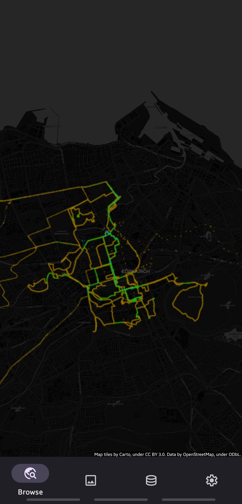
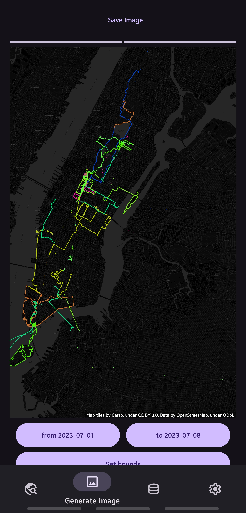
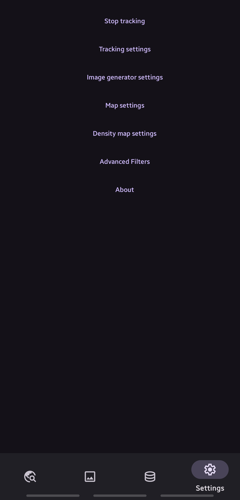

# openGPSLogger

## Releases

### 1.9.2
[apk](release/opengpslogger-1-9-2.apk)

#### Improvements
- Natural zooming

### 1.9.1

#### Minor improvements
- Refactor MapLayer in preparation for smoother scrolling
- Add checks for some cases that could crash the app before

### 1.9.0

#### Features
- Allow importing zip files that contain gpx files

### 1.8.1

#### Minor improvements
- Restructure data management tab UI
- Add button to go to data import guides

### 1.8.0

#### Features
- Add button to delete points by bounding box.
- When deleting points, also update the density map

#### Known issues
- When deleting points by bounding box, the bounding box may be slightly wider than what the screen shows.
- When pressing the delete by box multiple times in a row, the interactive map disappears.

### 1.7.0

#### Features
- Add button to delete points with a time filter.

### 1.6.0

#### Features
- Add import button and improve import view with feedback about the status.

### 1.5.0

#### Features
- Add drop shadow to points

### 1.4.0

#### Features
- Show last known location on browse map
- Automatically update UI while new points are being added to the density map

### 1.3.1

#### Fixes
- Stability improvements

### 1.3.0

#### Features
- Add privacy policy

#### Fixes
- Stability improvements

### 1.2.4

#### Fixes
- Set max wait time to 5 seconds on database connections to prevent deadlocks
- When opening the app after being in the background, force a point buffer sync
- Fix the image generator view not populating correctly initially
- When importing data from a file, add the data to the density maps

#### Images

  
  
  

### 1.2.3

#### Fixes
- Fix notification service being destroyed on app closure

### 1.2.2

#### Minor improvements
- Some battery usage optimisations

### 1.2.1

#### Minor improvements
- Make the location polling notification write to a separate small buffer database
- Better handling of database connections in general

### 1.2.0

#### Features
- Display copyright notice on browse view

### 1.1.3

#### Fixes
- Update zoom level while scrolling instead of on finger lift

### 1.1.2

#### Fixes
- Improve location request preset values

### 1.1.1

#### Fixes
- Improve responsiveness of browse view

### 1.1.0

#### Features
- Persist location of browse view to continue next time where the user left

### 1.0.2

#### Fixes
- Improved asynchronicity in image renderer and data view to not block the main thread.

### 1.0.1

#### Fixes
- The start / stop tracking button became inconsistent with the actual state in the last version, this is now fixed.
- Improvements to the tracking notification

### 1.0.0

Status: Alpha. Minor bugs and crashes are expected.

#### Features
- Full UI / UX rework, with bottom bar navigation. Adaptive view is now the default.

### 0.20.5

Status: proof of concept. Bugs and bad UI/UX are expected. Core functionality works.

#### Fixes
- Fully fix OSM tiles panning and zooming, and requesting new tiles

### 0.20.4

Status: proof of concept. Bugs and bad UI/UX are expected. Core functionality works.

#### Fixes
- Use cirlces instead of squares for density map rendering
- In adaptive view, cancel old tile requests if there are new requests

### 0.20.3

Status: proof of concept. Bugs and bad UI/UX are expected. Core functionality works.

#### Fixes
- Improve adaptive view zooming
- In adaptive view, use tileserver from settings

### 0.20.2

Status: proof of concept. Bugs and bad UI/UX are expected. Core functionality works.

#### Minor improvements
- Reduce flickeriness of points when zooming and panning in adaptive view

### 0.20.1

Status: proof of concept. Bugs and bad UI/UX are expected. Core functionality works.

#### Minor improvements
- Load osm tiles on opening adaptive view instead of after touch
- Overwrite old tiles with new tiles as they come in on zoom and pan to avoid black flickers

#### Known issues
- Zooming and panning translations aren't applied perfectly

### 0.20.0

Status: proof of concept. Bugs and bad UI/UX are expected. Core functionality works.

#### Features
- On tracking, add points to density map databases
- Improve density map color range

### 0.19.1
Status: proof of concept. Bugs and bad UI/UX are expected. Core functionality works.

#### Fixes
- Use different files for each level of density map

### 0.19.0

Status: proof of concept. Bugs and bad UI/UX are expected. Core functionality works.

#### Features
- Add multiple levels of density map (world, continent, country, city, street) with adaptive choice based on osm zoom level

### 0.18.0

Status: proof of concept. Bugs and bad UI/UX are expected. Core functionality works.

#### Features
- Initial version of an adaptive (zoomable) view with density map

### 0.17.1

Status: proof of concept. Bugs and bad UI/UX are expected. Core functionality works.

#### Fixes
- Improve density map visualisation

### 0.17.0

Status: proof of concept. Bugs and bad UI/UX are expected. Core functionality works.

#### Features
- Add continent density map visualisation

### 0.16.0

Status: proof of concept. Bugs and bad UI/UX are expected. Core functionality works.

#### Features
- Import files when opened with view action
- After importing file(s), automatically return to main activity

### 0.15.1
Status: proof of concept. Bugs and bad UI/UX are expected. Core functionality works.

#### Fixes
- Fix multiple dialog titles being Tracking settings incorrectly

### 0.15.0
Status: proof of concept. Bugs and bad UI/UX are expected. Core functionality works.

#### Features
- Allow specifying copyright watermark for manually added tile servers

### 0.14.0
Status: proof of concept. Bugs and bad UI/UX are expected. Core functionality works.

#### Features
- More visualisation settings:
  - Allow specifying color opacity percentage

### 0.13.0

Status: proof of concept. Bugs and bad UI/UX are expected. Core functionality works.

#### Features
- More visualisation settings:
  - Choose color mode (single color, or multi color per hour / day / month / year)
  - Choose color randomizer seed

### 0.12.0

Status: proof of concept. Bugs and bad UI/UX are expected. Core functionality works.

#### Features
- Add copyright notice to bottom right of picture, specifiable by source (text only)

#### Known issues
- When changing aspect ratio, text may get stretched until a reload is triggered
- It is not yet possible to add a copyright notice when manually adding a tile server in the app

#### Images

### 0.11.1

Status: proof of concept. Bugs and bad UI/UX are expected. Core functionality works.

#### Minor improvements
- Improve invalidation and redrawing of map
- Redraw map on tile server change
- Add glide caching for images

#### Fixes
- Fix issue where app would crash if the bounding box of selected points is too small

### 0.11.0

Status: proof of concept. Bugs and bad UI/UX are expected. Core functionality works.

#### Features
- New settings menu with the ability to select one of the default tile servers, or to add custom tile servers

### 0.10.0

Status: proof of concept. Bugs and bad UI/UX are expected. Core functionality works.

#### Features
- Allow importing json from local (phone) export of Google Maps Timeline data (Timeline.json)

### 0.9.0

Status: proof of concept. Bugs and bad UI/UX are expected. Core functionality works.

#### Features
- Allow importing json from local (phone) export of Google Maps Timeline data (location-history.json)

### 0.8.0

Status: proof of concept. Bugs and bad UI/UX are expected. Core functionality works.

#### Features
- Add minimum angle filter to filter out outliers

### 0.7.2
Status: proof of concept. Bugs and bad UI/UX are expected. Core functionality works.

#### Fixes
- Fix notification counter being stuck on 0

### 0.7.1
Status: proof of concept. Bugs and bad UI/UX are expected. Core functionality works.

#### Fixes
- Improve back filling neighbor distance and angle to reduce database usage

### 0.7.0
Status: proof of concept. Bugs and bad UI/UX are expected. Core functionality works.

#### Features
- Store angle and distance to neighbors for future outlier detection

### 0.6.0

Status: proof of concept. Bugs and bad UI/UX are expected. Core functionality works.

#### Features
- Add visualisation settings
  - specify point size
  - toggle lines (new)
  - specify line size
  - specify line disconnection by time

### 0.5.0

Status: proof of concept. Bugs and bad UI/UX are expected. Core functionality works.

#### Features
- Add minimum accuracy filter

### 0.4.1
Status: proof of concept. Bugs and bad UI/UX are expected. Core functionality works.

#### Fixes
- Fix notification sometimes showing 0 points tracked instead of actual amount

### 0.4.0

Status: proof of concept. Bugs and bad UI/UX are expected. Core functionality works.

#### Features
- Allow deleting user provided bounding boxes

### 0.3.0

Status: proof of concept. Bugs and bad UI/UX are expected. Core functionality works.

#### Features
- When clicking on the preview image, a popup opens allowing to zoom in

### 0.2.0

Status: proof of concept. Bugs and bad UI/UX are expected. Core functionality works.

#### Features
- Add tracking settings with highest, high, medium, low and passive presets

#### Fixes
- When swiping away notification, tracking is terminated
- Tracking status is stored (correctly show start / stop tracking)

### 0.1.0

Status: proof of concept. Bugs and bad UI/UX are expected. Core functionality works.

#### Features
- Add about page

### 0.0.1

Status: proof of concept. Bugs and bad UI/UX are expected. Core functionality works.

#### Features
- Track GPS in app
- Import `.gpx` files and `Records.json` from Google Takeout Location History (via sharing file from other app)
- Visualise points on OpenStreetMap background (copyright disclaimer: https://www.openstreetmap.org/copyright)
- Filter visualisation based on bounding box, time range and / or datasource
- Save bounding boxes
- Save visualisation as image
- View and backup database with point data (sqlite)

#### Known issues
- Database restore is not possible
- Tracking may stop working after some time, despite the notification still being present
- No app icon
- Deleting saved bounding boxes is not possible
- Importing gpx / json file directly via app is not possible
- After importing gpx / json file, app must be manually closed and reopened
- Setting button doesn't do anything

#### Images

